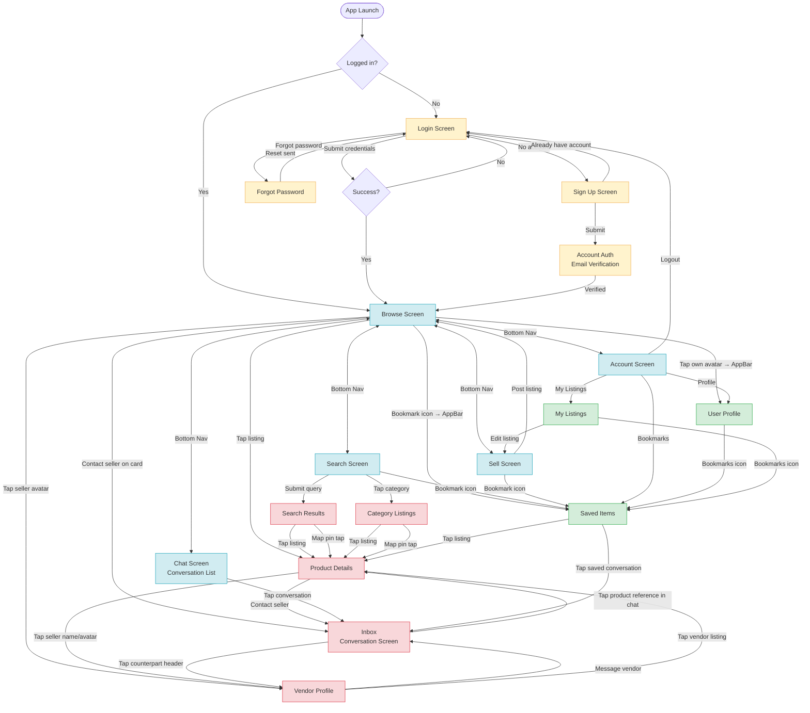
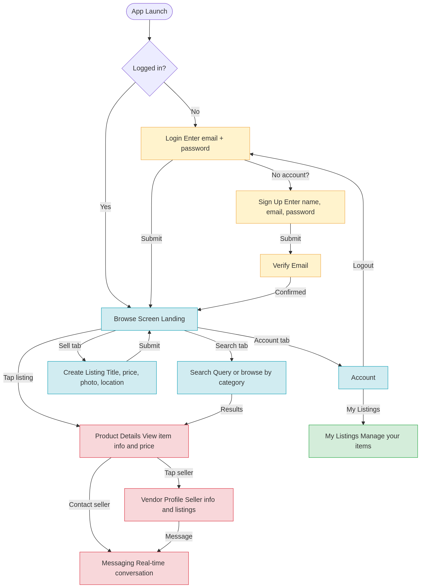
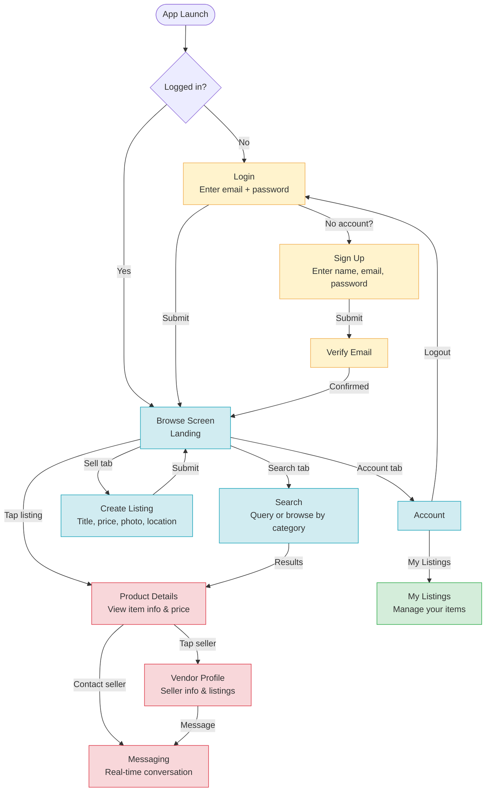

# Tukwatagane — User Operations Flowchart

## Legend

| Color | Group | Screens |
|---|---|---|
| Yellow | Auth flow | Login, Sign Up, Account Auth (email verify), Forgot Password |
| Blue | Bottom Nav tabs | Browse, Search, Sell, Chat List, Account |
| Red | Detail screens | Product Details, Vendor Profile, Search Results, Category Listings, Inbox |
| Green | Utility screens | Saved Items, User Profile, My Listings |

## Notes

- **`ChatScreen`** (`chat.dart`) = conversation *list*; **`InboxScreen`** (`inbox.dart`) = individual *conversation*
- **`SellScreen`** doubles as an edit screen — `MyListings` opens it pre-filled when editing a listing
- The bookmark shortcut to `Saved` is present on many screens (Browse, Search, Chat, Sell, CategoryListings, etc.) — collapsed in the diagram for clarity

---

## Simplified Flow

